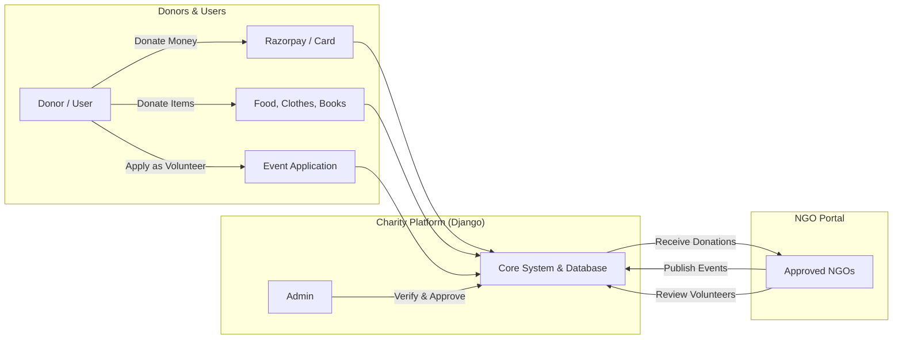

# Charity Management System

A Django web application connecting donors with registered NGOs for donations and volunteering.

## System Architecture & Workflow



## Features

- **NGO Management**: Registration approval workflow, profile customization, event management, and donation logs.
- **Donations**: Support for money (Card / Razorpay), food (weight, preparation and expiry dates), clothes, and books.
- **Volunteering**: Users can browse active events and apply for volunteer positions.
- **Authentication**: Password hashing using Django defaults with fallback for legacy plain-text accounts.

## Tech Stack

- **Backend**: Python, Django
- **Database**: SQLite
- **Payments**: Razorpay SDK
- **Frontend**: HTML, CSS, JavaScript, Bootstrap

## Setup and Installation

### 1. Virtual Environment
```bash
python3 -m venv .venv
source .venv/bin/activate  # On Windows: .venv\Scripts\activate
```

### 2. Install Dependencies
```bash
pip install -r requirements.txt
```

### 3. Run Migrations
```bash
python manage.py migrate
```

### 4. Run Server
```bash
python manage.py runserver
```

Access the app at `http://127.0.0.1:8000/`.

## Running Tests

```bash
python manage.py test
```

## Login Credentials

| Role | Portal / URL | Username / Email | Password |
| :--- | :--- | :--- | :--- |
| **Super Admin** | `/admin` | `admin` | `admin` |
| **Staff Admin** | `/admin` | `charity` | `charity` |
| **Approved NGO** | `/login` | `foundation@gmail.com` | `12345` |
| **Approved NGO** | `/login` | `communities@gmail.com` | `12345` |
| **User / Donor** | `/login` | `user@gmail.com` | `12345` |

## Project Structure

```text
charity/
├── manage.py
├── requirements.txt
├── db.sqlite3
├── .gitattributes
├── charity/             # Django project configuration
└── charityapp/          # App logic (views, forms, services, models, templates)
```
